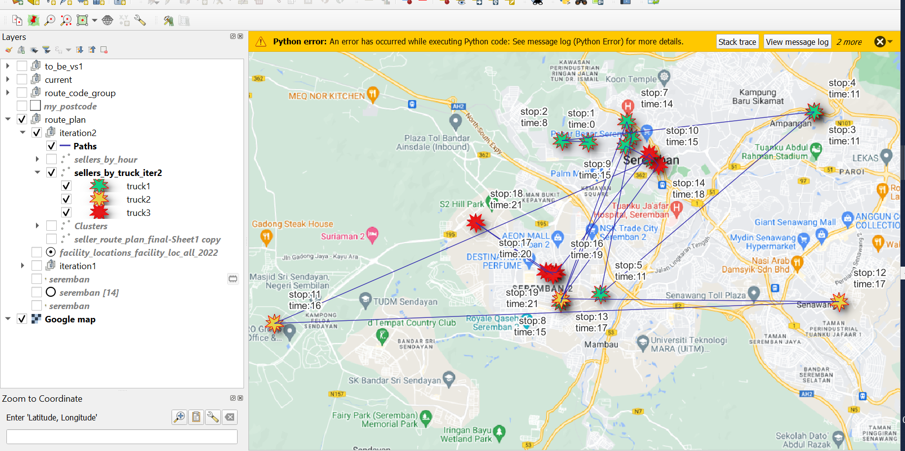

## FM Pickup Optimisation

**Start Date**: 16 Nov 2022
** End Date** : In progress

*files:*
[fm solver](https://github.com/user/repo/blob/branch/other_file.md)

[R file 1](https://github.com/user/repo/blob/branch/other_file.md)

### Problem Statement

FM Pickup time is given to driver discretion based on driver's intuition on most efficient route. However this is not optimal, and and algorithm is used to sequence FM pickup routes based on Ready-To-Ship (rts) updates in system

Data comes from:

1. RTS data for FM seller pickups
2. RTS data for DOP stations

Both data was provided by the First Mile Team, whom themselves got it from some dashboard.

In future, the algorithm should be writtedn to directly call from ODPS database

The main tools used in this project was R, SQL_ODPS, and Excel solver

R was used in the data cleaning portion, merging of data and outputs an excel workbook for the next optimisation process using Excel solver.

The first R file used is *fm_optimise_1.R* which outputs an excel file **fm_solver.xlsx**

That file is then used to run the  Solver function for a minimisation function of the outstanding parcels. 

### Output

The final output of this exercise is a route plan which contains the order of pickup by Segment, ordered in sequence by RTS hour.

This was further plotted in QGIS and path was plotted according to order sequence

